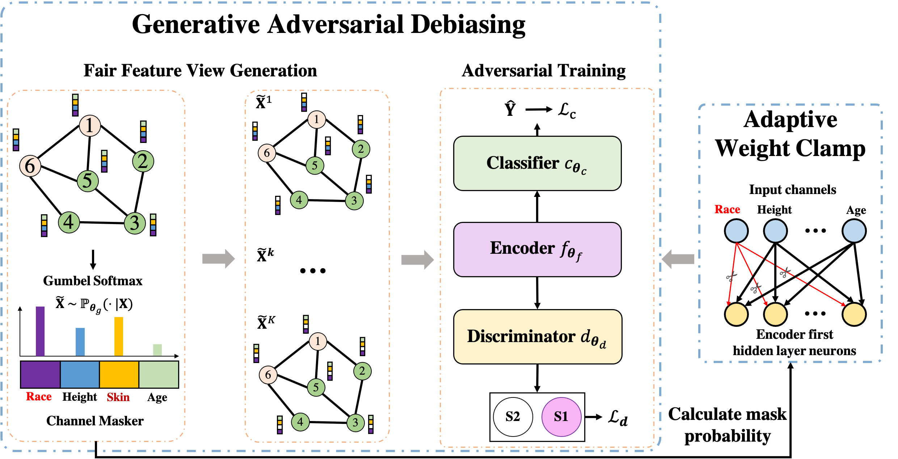
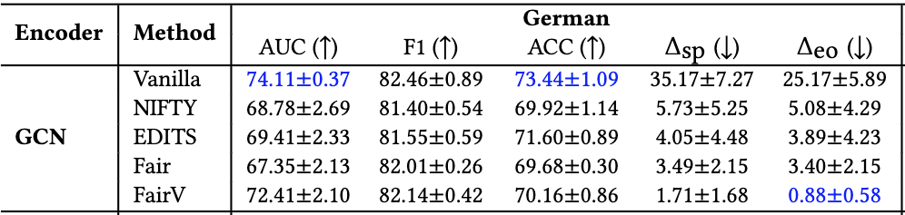

# FairVGNN
This repository is an official PyTorch(Geometric) implementation of FairVGNN in ["Improving Fairness in Graph Neural Networks via Mitigating Sensitive Attribute Leakage"](https://arxiv.org/abs/2206.03426).

**If you use this software, please consider citing:**
```linux
@inproceedings{fairview,
  author={Wang, Yu and Zhao, Yuying and Dong, Yushun and Chen, Huiyuan and Li, Jundong and Derr, Tyler},
  title={Improving Fairness in Graph Neural Networks via Mitigating Sensitive Attribute Leakage},
  booktitle={SIGKDD},
  year = {2022}
}
```

## Motivation
Node representation learned by Graph Neural Networks (GNNs) may inherit historical prejudices and societal stereotypes from training data, leading to discriminatory bias in predictions. This paper demonstrates that feature propagation could vary feature correlations and cause the leakage of sensitive information to innocuous feature channels, which could further exacerbate discrimination in predictions.

Intuitively, features that are more correlated to sensitive features encode more discriminative information in learned node representations. Here we mask each feature channel based on their Pearson Correlation to the sensitive feature. We could clearly see that as we mask more sensitive-correlated feature channel, we end up with higher discrimination and bias in predicted results.


However the feature correlation would change after feature propagation in GNNs, as demonstrated by the following Figure on German dataset. We could clearly see that many innocuous feature channels become highly-correlated to sensitive one after propagation.


## Framework
To prevent the sensitive leakage caused by feature propagation, we propose a novel framework FairVGNN to automatically learn fair views by identifying and masking sensitive-correlated channels and adaptively clamping weights to avoid leveraging sensitive-related features in learning fair node representations. The whole flowchart of FairVGNN is shown below:




## Configuration
The default version of python we use is 3.8.10. Please install all necessary python packages via:
```linux
pip install -r requirements.txt
```
Please exclusively install torch 1.10.0+cu113 [here](https://pytorch.org/get-started/previous-versions/) and then install its compatiable torch-geometric following instructions [here](https://pytorch-geometric.readthedocs.io/en/latest/notes/installation.html).


## Result
Here we list the performance of our model (**FairV**). To reproduce the table, please run the following command:
```linux
bash run_german.sh (bash run_{dataset}.sh for other datasets.)
```


We want to kindly note that the table is obtained based on the scatter-based propagation, which is a non-deterministic operation (https://github.com/rusty1s/pytorch_scatter/issues/226). Therefore, we would end up with different results after each running. Furthermore, we provide the sparse-matrix-based propagation, which is a deterministic operation. Both of these two versions of propagation are implemented in our repo for GCN baselines.


## Reproduce preliminary results
The **prelim** folder includes all details to reproduce all preliminary results in this paper.

## Analysis the effect of generative adversarial analysis
```linux
bash run_adv.sh
```

## Analysis the effect of adaptive weight clipping
```linux
bash run_adwc.sh
```


## Acknowledgement: The code is developed based on part of the code in the following papers:
```linux
[1] Chirag Agarwal, Himabindu Lakkaraju, and Marinka Zitnik. Towards a unified framework for fair and stable graph representation learning. arXiv preprint arXiv:2102.13186, 2021.
```
