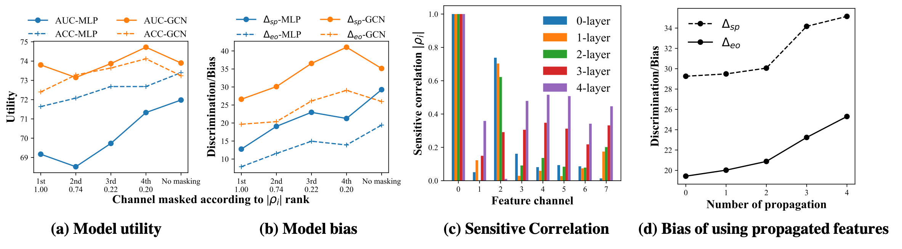

## Preliminary results for FairVGNN


### Figure 1(a)-(d)


* To reproduce Figure 1(a)-(b)
```linux
bash run.sh
```
* To reproduce Figure 1(c)
```linux
bash run.sh
```
* To reproduce Figure 1(d)
```linux
bash run.sh
```

