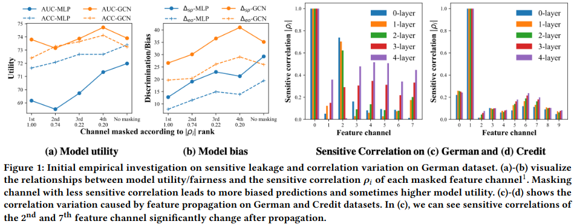
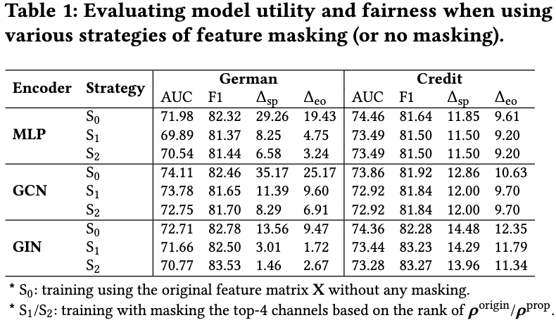

# Preliminary results for FairVGNN

Before running the following scripts, please first unzip the three datasets into the dataset folder.

## Figure 1(a)-(d)


* To reproduce Figure 1
```linux
bash run_prelim_figure1.sh
```

## Table 1


* To reproduce Table1
```linux
bash run_prelim_table.sh
```
